# Freedom Bot — Complete Architecture Documentation

## Overview

**Freedom Bot** is a portfolio-aware, multi-strategy autonomous crypto trading bot built with Python and PyQt5. It runs live trading cycles at configurable intervals, scores opportunities using 13+ technical strategies, and executes rotations when high-confidence signals align. The system integrates with exchange APIs (Binance, Kraken), connects to **Freedom Scout** (a sister service for market scanning), and provides detailed backtesting and replay capabilities.

**Why this design**: The bot needed to manage portfolio risk across multiple coins simultaneously, score opportunities in a consistent way that could be backtested and replayed, and allow real-time manual control + AI veto through the GUI. The modular strategy system makes it easy to toggle strategies on/off, compare performance, and adapt to different market regimes.

---

## System Architecture Diagram

```mermaid
graph TB
    subgraph external["External Services"]
        Binance["Binance API<br/>(OHLCV, orders)"]
        Kraken["Kraken API<br/>(OHLCV, orders)"]
        Scout["Freedom Scout<br/>(ZMQ PUB/SUB)"]
        OpenAI["OpenAI / GROK<br/>(veto confirmation)"]
    end
    
    subgraph gui["GUI Layer — PyQt5"]
        MainWindow["MainWindow<br/>(tabs + menu)"]
        TradingPanel["TradingPanel<br/>(bot control)"]
        DashboardPanel["DashboardPanel<br/>(portfolio view)"]
        ChartPanel["ChartPanel<br/>(candles + indicators)"]
        AlertsPanel["AlertsPanel<br/>(notifications)"]
        BacktestPanel["BacktestPanel<br/>(replay UI)"]
        SettingsDialog["SettingsDialog<br/>(thresholds)"]
    end
    
    subgraph core["Core Trading Engine"]
        FreedomBot["FreedomBot<br/>(main cycle loop)"]
        Scoring["Scoring Engine<br/>(13+ strategies)"]
        StrategyMap["StrategyMap<br/>(MA, RSI, Supertrend...)"]
        Regime["Regime Classifier<br/>(5 BTC states)"]
        PaperTrader["PaperTrader<br/>(paper money)"]
        FreedomReplay["FreedomReplay<br/>(backtest engine)"]
    end
    
    subgraph bridge["Integration Bridges"]
        ExchangeClient["ExchangeClient<br/>(abstract API)"]
        BinanceClient["BinanceClient<br/>(impl)"]
        KrakenClient["KrakenClient<br/>(impl)"]
        ScoutBridge["ScoutBridge<br/>(ZMQ daemon)"]
        ApiBridge["ApiBridge<br/>(Flask localhost)"]
    end
    
    subgraph state["State & Config"]
        Settings["Settings<br/>(JSON config)"]
        TradeLog["Trade Log<br/>(CSV + JSON)"]
        StrategyLearner["StrategyLearner<br/>(adaptive weights)"]
        AlertManager["AlertManager<br/>(notification mgmt)"]
    end
    
    %% Data flows
    TradingPanel -->|start/stop/cycle| FreedomBot
    TradingPanel -->|reads| Settings
    TradingPanel -->|displays| PaperTrader
    FreedomBot -->|scores coins| Scoring
    Scoring -->|runs each strategy| StrategyMap
    Scoring -->|checks regime| Regime
    FreedomBot -->|executes| PaperTrader
    FreedomBot -->|publishes logs| TradeLog
    FreedomBot -->|subscribes| ScoutBridge
    ScoutBridge -->|ZMQ packets| Scout
    FreedomBot -->|writes heartbeat| ScoutBridge
    FreedomBot -->|reads regime| Regime
    FreedomBot -->|fetches OHLCV| ExchangeClient
    ExchangeClient -->|routes| BinanceClient
    ExchangeClient -->|routes| KrakenClient
    FreedomReplay -->|walks history| ExchangeClient
    FreedomReplay -->|uses same scoring| Scoring
    FreedomReplay -->|writes actions| TradeLog
    DashboardPanel -->|reads equity| PaperTrader
    ChartPanel -->|reads candles| ExchangeClient
    BacktestPanel -->|triggers| FreedomReplay
    TradingPanel -->|gets activity| ScoutBridge
    StrategyLearner -->|adapts weights| Scoring
    ApiBridge -->|localhost queries| FreedomBot
    ApiBridge -->|localhost queries| PaperTrader
```



---

## Core Components & Data Flow

### 1. **FreedomBot** — The Trading Engine
- **Location**: `core/freedom_bot.py`
- **Responsibility**: Main trading cycle loop that runs at fixed intervals
- **Key Methods**:
  - `score_symbol(symbol, klines, strategies, regime)` → float (0–100 score)
  - `run_cycle(check_veto=True)` → executes one full trading round
  - `scan_open_positions()` → scores existing holdings
  - `scan_opportunities()` → scores new coins from Binance USDT universe
  - `execute_rotation(sell_symbol, buy_symbol, reason)` → swaps positions if veto passes

**Why this design**: The cycle-based approach lets Freedom Bot batch decisions (all scores computed, thresholds checked, then execute) rather than react individually to every signal. This reduces order spam and allows the AI veto to see the full rotation before committing.

**Data flow**:
1. Poll price data (OHLCV) from ExchangeClient
2. Classify market regime (BTC state → bull/bear/neutral)
3. Score open positions using 13 strategies + momentum state
4. Score top opportunity coins (trending, gainers, early movers)
5. If sell opportunity exists (weak holder) AND buy opportunity exists (strong new entry) AND rotation improves portfolio by ROTATION_IMPROVEMENT %, call AI veto
6. If veto passes, execute sell then buy, log trade, update portfolio
7. Emit structured logs that TradingPanel displays

**Key thresholds** (all configurable via Settings):
- `SELL_THRESHOLD` (default ~35) — score below this triggers sell candidate
- `BUY_THRESHOLD` (default ~65) — score above this triggers buy candidate
- `ROTATION_IMPROVEMENT` (default 15%) — new opportunity must be 15% better than old position
- `MOMENTUM_WEIGHT` — dynamically weighted based on regime (higher in bull, lower in bear)

### 2. **Scoring System** — 13+ Technical Strategies
- **Location**: `core/strategies/` (21 files)
- **Base Class**: `base_strategy.py` → `Signal` dataclass

**Strategy portfolio**:

| Strategy | Type | Win Rate | Disabled by Default? |
|----------|------|----------|----------------------|
| EMA Ribbon | Trend following | ~70% | No |
| Supertrend + ADX | Trend + volatility | ~65% | No |
| Hull Moving Average | Fast trend | ~68% | No |
| Fibonacci Retracement | Support/resistance | ~62% | No |
| ATR Squeeze | Volatility | ~55% | No |
| Keltner Squeeze | Volatility | ~58% | No |
| OBV (On-Balance Volume) | Volume confirmation | ~60% | No |
| Support & Resistance | Price levels | ~52% | No |
| Bollinger Bands | Mean reversion | ~40% | Yes |
| RSI Oversold/Overbought | Mean reversion | ~0% | Yes |
| MACD Momentum | Momentum | ~23% | Yes |
| Moving Average Crossover (50/200) | Slow trend | ~15% | Yes |
| Ichimoku Cloud | Trend + support | ~30% | Yes |

**Why this design**: Each strategy specializes in one pattern (trend, mean-reversion, support, volume). The score is a weighted average of all enabled strategies' signals (1=bullish, 0=bearish, 0.5=neutral). Backtesting discovered that fast trend strategies (EMA, Hull, Supertrend) have the highest edge, while slow/mean-reversion strategies add noise. Users can disable underperforming strategies for their timeframe/regime.

**Timeframe intelligence**: Certain strategies are auto-disabled by timeframe:
- **1h** (fast candles) — disable slow strategies like Ichimoku, 200-MA, MACD
- **4h** (balanced) — disable mean-reversion, Parabolic SAR
- **1d** (slow candles) — disable fast reversal strategies, daily VWAP

### 3. **Regime Classifier** — Market State Detection
- **Location**: `core/freedom_regime.py`
- **Job**: Classify BTC into 5 states + coin bearishness

**The 5 BTC Regimes**:
1. `REGIME_STRONG_BULL` — BTC > 50-MA, ADX > 30, price in upper half of Bollinger
2. `REGIME_WEAK_BULL` — BTC trending but not strong
3. `REGIME_NEUTRAL` — BTC sideways, ADX < 20
4. `REGIME_WEAK_BEAR` — BTC below 50-MA
5. `REGIME_STRONG_BEAR` — BTC far below 50-MA, high ADX, volume surging down

**Why this matters**: The scoring engine applies regime-aware multipliers:
- Bull regimes → higher position allocation, more aggressive entry
- Bear regimes → fewer buys, tighter stop-loss, higher sell threshold
- Neutral regimes → reduce trade frequency, require higher confidence

**Coin-level bearishness**: Each coin is checked for bearish overrides (e.g., a coin breaking below critical support is marked "bearish" even if BTC is bullish). This prevents chasing losers.

### 4. **Paper Trader** — In-Memory Portfolio
- **Location**: `core/paper_trader.py`
- **Responsibility**: Manages virtual money, tracks positions, computes P&L

**State**:
- `balance: float` — USDT available
- `positions: dict[symbol] → {qty, entry_price, entry_time}` — current holdings
- `closed_trades: list` — history of all sold positions with realized P&L

**Methods**:
- `buy(symbol, usdt_amount, price)` → executes buy, updates balance & positions
- `sell(symbol, qty, price)` → executes sell, realizes P&L, updates balance
- `get_total_equity()` → sum of balance + market value of all positions
- `get_pnl()` → total realized + unrealized profit/loss

**Why in-memory**: Speeds up backtesting (no DB queries). On app restart, balances are re-initialized from the latest trade log CSV. Production bots use paper_balance from settings as the starting seed.

### 5. **FreedomReplay** — Historical Backtester
- **Location**: `core/freedom_replay.py`
- **Job**: Walk through historical candles and simulate what Freedom Bot would have done

**Input**:
- Date range (start → end)
- Symbols to backtest (or auto-detect from top gainers)
- Timeframe (1m, 5m, 1h, 4h, 1d)

**Output** (`ReplayResult`):
- Starting balance, ending balance, return %
- Total trades, win rate, max drawdown
- List of actions (each buy/sell with reason, price, P&L)
- Equity curve (balance over time)

**Why separate from live bot**: Replay is read-only. It lets users test strategy changes risk-free before running live. Replay uses the exact same scoring logic as the live bot, making it a true simulator.

### 6. **Scout Bridge** — Integration with Freedom Scout
- **Location**: `core/scout_bridge.py`
- **Protocol**: ZMQ PUB/SUB (message queue pattern)

**How it works**:
1. Scout (running separately) publishes `OpportunityPacket` objects on ZMQ port 5555
   - Each packet contains: symbol, entry signal, confidence score, indicators
2. ScoutBridge runs a daemon thread that subscribes and queues packets
3. Each cycle, FreedomBot calls `bridge.drain_packets()` to grab new opportunities
4. FreedomBot simultaneously publishes heartbeats on port 5556 with current settings hash
5. Scout compares hash; if different, applies new settings from Freedom Bot

**Why ZMQ**: Lightweight, language-agnostic, no server dependency, fast inter-process communication.

**Data flow**: Scout → (ZMQ 5555) → FreedomBot.ScoutBridge.drain_packets() → added to scan list → scored alongside Binance opportunities

### 7. **Exchange Clients** — Binance & Kraken APIs
- **Base Class**: `core/exchange_client.py` (abstract)
- **Implementations**: 
  - `BinanceClient` — REST API wrapper for USDT pairs
  - `KrakenClient` — REST API wrapper for Kraken pairs

**Methods**:
- `fetch_klines(symbol, interval, limit)` → returns OHLCV as pandas DataFrame
- `fetch_ticker(symbol)` → current price + 24h volume
- `place_order(symbol, side, qty, price)` → executes market/limit order
- `cancel_order(order_id)` → cancels open order

**Why abstraction**: FreedomBot calls only `ExchangeClient` methods. You can swap Binance ↔ Kraken without changing bot logic. (Note: Live trading not yet implemented — paper trading only.)

### 8. **API Bridge** — Localhost REST Interface
- **Location**: `api_bridge.py`
- **Port**: 127.0.0.1:5000 (loopback only, secure)

**Endpoints**:
- `GET /health` — is bot alive?
- `GET /status` — current portfolio snapshot (balance, positions, P&L)
- `POST /run_cycle` — trigger one bot cycle immediately
- `POST /settings` — update thresholds (BUY_THRESHOLD, SELL_THRESHOLD, etc.)
- `GET /logs` — last N lines of trade log CSV

**Why useful**: Allows external tools (Axel notebooks, cron jobs, Telegram bots) to query bot state and push commands without touching the GUI.

---

## GUI Architecture

### **MainWindow** — Tab-based Dashboard
- **Location**: `gui/main_window.py`
- **Role**: Assembles all panels into a tabbed interface

**Tabs**:
1. **Trading Panel** — Bot controls, strategy selector, activity log
2. **Dashboard** — Portfolio overview, equity curve, holdings
3. **Chart Panel** — Candlestick charts + technical indicators
4. **Summary Panel** — Key metrics (win rate, P&L, max drawdown)
5. **Alerts Panel** — Notifications (new trades, regime changes)
6. **Signal Feed Panel** — Live signal stream from Scout
7. **Backtest Panel** — Replay UI (date range, symbols, run test)
8. **Health Panel** — System status (API connectivity, memory, CPU)
9. **Portfolio Panel** — Holdings breakdown by coin + regime
10. **Trends Panel** — Market sector rotation analysis
11. **Chat Panel** — Chat with portfolio coach (AI advisor)
12. **Help Panel** — Documentation + keyboard shortcuts

**Menu**:
- File → Settings, Load Session, Save Session, Exit
- Tools → Transfer Dialog (manual buy/sell), Batch Run Tests, Chart Popout
- View → Fullscreen, Reset Layout
- Help → About, Docs, Check for Updates

### **TradingPanel** — Core Bot Controller
- **Location**: `gui/trading_panel.py`

**Sections**:

1. **Bot Control** (top):
   - Start/Stop button (toggles `FreedomBot.run()`)
   - Cycle interval spinner (seconds between scans)
   - Manual "Run Cycle Now" button
   - Scout connection indicator (green if connected to port 5555)

2. **Settings Form** (left side):
   - Buy Threshold slider (35–100)
   - Sell Threshold slider (0–65)
   - Rotation Improvement % (5–50%)
   - Max Open Positions (1–50)
   - Max Symbol Allocation % (1–100)
   - Watchdog interval (seconds)
   - DCA settings (enabled, drop %, tranches)
   - Risk % per trade (1–10%)

3. **Strategy Selector** (center):
   - Checklist of all strategies with checkboxes
   - "Recommended for [timeframe]" hint shows which strategies are auto-disabled
   - Expandable detail showing win rate % for each strategy in backtest results
   - Resets after backtesting so users can see if toggling strategies improved performance

4. **Activity Log** (right side):
   - Real-time structured logs from ScoutBridge + FreedomBot
   - Colors: Green (buy), Red (sell), Yellow (warning), Blue (info)
   - Timestamps, reason text, price, P&L

5. **Trade Journal Tab** (bottom):
   - Table of last 50 closed trades
   - Columns: Entry Time, Entry Price, Exit Time, Exit Price, P&L %, Reason, Strategy
   - Sortable by any column

**Why this layout**: Controls on the left (easy to tweak thresholds mid-session), activity on the right (watch what happened), journal below (review decisions). Matches the "vibe" of fast iteration + feedback.

### **DashboardPanel** — Portfolio at a Glance
- Shows current balance, equity, max drawdown, win rate
- Pie chart of allocation by symbol
- Equity curve (balance over time)
- Top 3 holdings by size
- Daily returns histogram

### **ChartPanel** — Technical Analysis View
- Candlestick chart with OHLCV data
- Overlays (EMA Ribbon, Bollinger Bands, Support/Resistance levels)
- Volume bars at bottom
- Regime indicator (colored background: green=bull, red=bear, gray=neutral)
- Crosshair cursor + tooltips for exact values
- Zoom/pan controls

---

## Data Flow — One Complete Cycle

### Scenario: FreedomBot detects rotation opportunity at 14:05 UTC

**T=0 sec**: Cycle starts, `FreedomBot.run_cycle()` called

**T=0–1 sec**: **Fetch market data**
```
ExchangeClient.fetch_klines("BTCUSDT", "4h", 500)
ExchangeClient.fetch_klines("ETHUSDT", "4h", 500)
... (top 50 coins)
```
→ Fills local cache of recent OHLCV

**T=1–2 sec**: **Classify regime**
```
compute_btc_regime(btc_klines)  →  returns REGIME_STRONG_BULL
apply_regime_params(current_regime, thresholds)  →  boosts BUY_THRESHOLD by -5 (easier to buy in bull)
```

**T=2–3 sec**: **Score open positions**
```
for symbol in paper_trader.positions:
    score = score_symbol(symbol, klines, enabled_strategies, regime)
    # Example: SOLUSDT has 8 wins out of 13 strategies
    # score = (8/13) * 100 = 61.5
    # 61.5 < SELL_THRESHOLD (70) → sell candidate
```

**T=3–5 sec**: **Scan new opportunities**
```
scan_opportunities()  # checks top gainers, trending, early movers
for symbol in opportunity_list:
    score = score_symbol(symbol, klines, enabled_strategies, regime)
    # Example: PEPEUSDT has 11 wins out of 13
    # score = 84.6
    # 84.6 > BUY_THRESHOLD (65) → buy candidate
```

**T=5–6 sec**: **Check rotation conditions**
```
if (
    weak_symbol == "SOLUSDT" and weak_score == 61.5  # below sell threshold
    and strong_symbol == "PEPEUSDT" and strong_score == 84.6  # above buy threshold
    and (strong_score - weak_score) >= ROTATION_IMPROVEMENT (15%)  # 23% > 15% ✓
):
    # Veto check
    ai_response = call_grok(
        f"I want to sell SOL at ${current_sol_price} and buy PEPE at ${current_pepe_price}. "
        f"SOL score is {weak_score}, PEPE score is {strong_score}. Approve?"
    )
    if ai_response.approved:
        execute_rotation("SOLUSDT", "PEPEUSDT", reason="Momentum rotation + regime alignment")
```

**T=6–7 sec**: **Execute and log**
```
paper_trader.sell("SOLUSDT", qty=..., price=...)  → realizes P&L
paper_trader.buy("PEPEUSDT", qty=..., price=...)   → new position
log_trade(
    symbol="SOLUSDT", action="SELL", price=19.50, usdt=4875,
    pnl_pct=+12.3, reason="Weak score, rotation to PEPE",
    strategy="Supertrend breakout"
)
```

**T=7 sec**: **Emit signals**
```
ScoutBridge.drain_packets()  # check if Scout found anything else
TradingPanel.update_activity_log(f"✓ SOLD SOL 12.3% profit → BOUGHT PEPE @$0.0000234")
AlertManager.notify("ROTATION: SOL → PEPE, +12.3% realized")
```

**T=7+ sec**: **Cycle complete**, sleep until next interval

---

## Configuration & Settings

**Location**: `config/settings.py` (read-only defaults) + `settings.json` (user overrides)

**Key settings**:
- `PAPER_BALANCE` — initial USDT balance
- `FREEDOM_BUY_THRESHOLD`, `FREEDOM_SELL_THRESHOLD` — scoring thresholds
- `FREEDOM_MAX_OPEN_POSITIONS` — max concurrent holdings
- `TIMEFRAME` — candle interval (1h, 4h, 1d)
- `FREEDOM_DISABLED_STRATEGIES` — which strategies to ignore
- `DCA_ENABLED`, `DCA_TRANCHES`, `DCA_DROP_PCT` — dollar-cost-average settings
- `MARKET_REGIME_FILTER` — force specific regime (useful for testing)
- `EXCHANGE_CONFIG` — which exchange (Binance/Kraken) + API keys
- `SCOUT_ENABLED` — whether to listen to Scout packets
- `LOSS_COOLDOWN_MINUTES` — how long to wait after a loss before re-entering

**Why JSON**: Settings are persisted, easy to edit, can be pushed to bot via API without restart.

---

## Strategy Learning & Adaptation

**Location**: `utils/strategy_learner.py`

After each cycle, the bot collects:
- Which strategies voted for the winning trade (the trade that executed)
- Which strategies voted against it (false signals)
- The eventual P&L of that trade

These are accumulated into an adaptive weight matrix:
```
strategy_weight["Supertrend"] ← higher if it predicted wins
strategy_weight["RSI"] ← lower if it predicted many losses
```

When scoring in the next cycle, instead of equal weights:
```
score = Σ(strategy_signal * adaptive_weight) / Σ(adaptive_weight)
```

This causes the bot to evolve toward strategies that work for the current market.

**Why useful**: No manual tweaking needed. If the market regime shifts and RSI suddenly stops working, the learner automatically reduces RSI's influence.

---

## Error Handling & Watchdog

**Watchdog** (`core/freedom_bot.py`):
- Tracks when the last successful cycle completed
- If `now() - last_cycle_time > WATCHDOG_INTERVAL_SEC`, bot is stuck
- Sends alert to GUI, logs error, may auto-restart if configured

**Graceful degradation**:
- If Scout is down, bot skips `drain_packets()` and continues with Binance data
- If an exchange API is slow, bot uses cached klines instead of blocking
- If strategy raises an exception, it's caught and logged, other strategies continue
- If veto service (OpenAI) times out, veto defaults to APPROVE (fail-safe)

---

## Testing & Validation

### Unit Tests
- `tests/` directory contains test suites
- Strategies tested against known candle patterns (e.g., "EMA should cross on this candle")
- Paper Trader tested for order execution, P&L computation
- Regime classifier tested against historical regime transitions

### Integration Tests
- Run replay on 1-year historical data, check that equity curve is smooth
- Verify that live bot and replay produce same scores for same inputs
- Test Scout packet parsing and queuing

### Backtesting Workflow
User → BacktestPanel UI → calls `FreedomReplay.run()` → outputs `ReplayResult` → displays equity curve + win rate in ChartPanel

---

## Future Improvement Areas

### 1. **Live Trading** (Currently Paper-Only)
- Implement `execute_order()` in `ExchangeClient` subclasses
- Add position-size risk management (Kelly Criterion or volatility-scaled sizing)
- Real slippage & fee modeling
- Partial fill handling for large orders

### 2. **Multi-Timeframe Analysis**
- Instead of one fixed timeframe, analyze 1h + 4h + 1d simultaneously
- Use daily trend as filter (only long in daily uptrend) + 1h entries
- Would reduce false signals, especially in choppy markets

### 3. **Sector Rotation**
- Group coins by sector (DeFi, Layer-2, AI, NFT, etc.)
- Allow user to cap exposure per sector
- Auto-detect sector strength and rotate between best sectors
- Currently TrendsPanel has sector rotation UI but not integrated into scoring

### 4. **Advanced Risk Management**
- Position-sizing using Kelly Criterion
- Correlation matrix (avoid loading up on coins that move together)
- VaR (Value at Risk) limits per position
- Trailing stop-loss that tightens as trades become profitable

### 5. **Strategy Discovery**
- Allow users to upload custom strategy Python files
- Sandbox execution + auto-registration into STRATEGY_MAP
- Backtest custom strategies immediately without code changes

### 6. **Real-Time Alerts to Mobile**
- Telegram/Discord/SMS when major trades execute
- Regime change alerts pushed to phone
- Currently AlertManager supports this but Telegram integration is optional

### 7. **Consensus with Other Bots**
- Subscribe to other trading bot signals (via ZMQ or REST)
- Only execute trade if multiple bots agree
- Reduces false signals, increases conviction

### 8. **Reinforcement Learning Rewards**
- Instead of static adaptive weights, use RL to train which strategies to use
- Reward = realized P&L per trade, penalty = large drawdowns
- Over time, bot learns optimal strategy mix for market regime

### 9. **Explainability Dashboard**
- For each buy/sell decision, show which strategies voted for/against
- Confidence meter (unanimous agreement = high confidence)
- Helps users understand why bot made each decision

### 10. **Exchange Arbitrage**
- Detect price differences between Binance and Kraken
- Execute pairs of orders (buy on cheaper, sell on expensive)
- Risk-free profit, but needs fast execution + low fees

---

## Key Files Reference

### Core Engine
- `core/freedom_bot.py` — main cycle loop, scoring, rotation logic
- `core/freedom_replay.py` — backtest simulator
- `core/scout_bridge.py` — Scout integration daemon
- `core/strategies/` — 21 technical strategy implementations
- `core/freedom_regime.py` — market regime classifier

### Clients & Exchange
- `core/exchange_client.py` — abstract base
- `core/binance_client.py` — Binance REST wrapper
- `core/kraken_client.py` — Kraken REST wrapper
- `core/paper_trader.py` — in-memory portfolio

### GUI
- `gui/main_window.py` — main app window + tabs
- `gui/trading_panel.py` — bot control & activity log
- `gui/dashboard_panel.py` — portfolio overview
- `gui/chart_panel.py` — candlestick + indicators
- `gui/backtest_panel.py` — replay UI
- `gui/alerts_panel.py` — notifications

### Utilities & Config
- `config/settings.py` — settings definitions + defaults
- `utils/strategy_learner.py` — adaptive weights
- `utils/trade_logger.py` — CSV + JSON trade logging
- `utils/market_regime.py` — regime detection helpers
- `api_bridge.py` — localhost REST API

### Data Flow Files
- `trade_journal_TIMESTAMP.csv` — all trades executed
- `freedom_bot_trades.csv` — archive of past trades
- `freedom_batch_results.json` — backtest output summaries
- `settings.json` — user settings override
- `cryptobot_trades.log` — timestamped debug logs

---

## Why This Architecture Works

1. **Modularity**: Each component (strategies, exchange, GUI) is independent. Swap a strategy or exchange without touching others.

2. **Auditability**: Every trade is logged with its reason, score, and which strategies contributed. You can always explain "why was this trade made?"

3. **Reproducibility**: Replay uses identical scoring logic as live bot. Backtest results predict live performance reasonably well (accounting for slippage/fees).

4. **Extensibility**: Add new strategies by copying `base_strategy.py`, add new exchanges by subclassing `ExchangeClient`, add new GUI panels by subclassing `QWidget` + registering in MainWindow tabs.

5. **Safety**: Paper trading by default. AI veto gates risky rotations. Watchdog detects hangs. Graceful degradation if Scout/API is down.

6. **Learning**: Adaptive weights + backtest results allow the bot to improve over time without manual tuning.

7. **Observability**: Activity log, equity curve, trade journal, and REST API let you monitor bot behavior in real-time and troubleshoot issues.

---

## Conclusion

Freedom Bot is a production-ready framework for autonomous, portfolio-aware crypto trading. The modular scoring system, regime-aware thresholds, and tight integration with Scout and backtesting make it a powerful tool for both automated and semi-automated strategies. The PyQt5 GUI provides real-time visibility into decisions, and the JSON configuration + REST API enable external tools and notebooks to query or control the bot safely.

The next generation (live trading, multi-timeframe, sector rotation) is blocked on implementation, not design — the architecture already supports these features cleanly.
